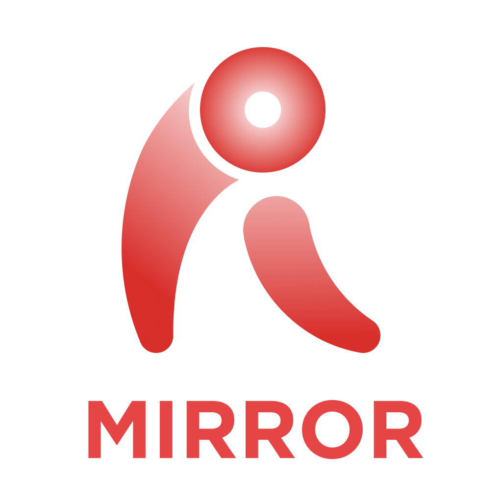

  
  <h1 align="center">RevoMirror-iOS</h1>
  <h4 align="center">An iOS screen mirroring client for low-latency LAN streaming.</h4>

  <b>English</b> | <a href="README.zh-CN.md">简体中文</a>

## About

**RevoMirror-iOS** is an iOS client developed by **Revopoint Software** for
low-latency screen mirroring and remote interaction over a local network.

It is a derivative work based on
[Moonlight iOS/tvOS](https://github.com/moonlight-stream/moonlight-ios)
(licensed under GPL-3.0). RevoMirror-iOS reuses Moonlight's proven streaming
client foundation and adapts it for the RevoMirror mirroring workflow, UI,
settings, localization, and product branding.

RevoMirror-iOS works with a compatible host such as RevoMirror-PC or Sunshine.
The host performs screen capture and video encoding, while the iOS app discovers
the host, pairs with it, receives the stream, and sends touch/controller input
back to the host.

## Key Features

- **iPhone and iPad client** for receiving PC screen streams over LAN.
- **Low-latency streaming** based on the Moonlight/Sunshine protocol stack.
- **Host discovery and pairing** using the existing Moonlight-compatible flow.
- **Touch and controller input** for remote interaction with the host.
- **Landscape mirroring UI** optimized for screen casting.
- **Localized UI** with language selection and RevoMirror-specific prompts.
- **In-app legal resources** including user agreement, privacy policy, and GPLv3
  notice entry.

## How It Works

RevoMirror-iOS keeps the core Moonlight client architecture:

- Host discovery through mDNS and manual address entry.
- Pairing and certificate handling for secure host connections.
- App/session launch requests through Moonlight-compatible HTTP APIs.
- Low-latency video streaming through `moonlight-common`.
- Touch, controller, keyboard, and mouse input forwarding.

On top of this, RevoMirror-iOS changes the user experience from a game-library
client into a mirroring-focused client. After a host is selected and paired, the
app can enter the stream flow directly with RevoMirror defaults such as device
screen resolution, 60 FPS, absolute touch mode, and PC-side audio playback.

## Platform Support

| Role | iPhone | iPad | Apple TV |
|------|:------:|:----:|:--------:|
| RevoMirror-iOS client | Supported | Supported | Not targeted by RevoMirror-iOS |

**Host requirement:** A Moonlight-compatible host such as RevoMirror-PC or
Sunshine running on the same LAN/subnet.

## System Requirements

### iOS Client

- iOS/iPadOS 13.0 or later.
- A device capable of hardware video decoding.
- Local network access permission.
- 5 GHz Wi-Fi or a stable LAN connection is recommended.

### Host

- RevoMirror-PC or Sunshine-compatible host.
- Hardware video encoding is recommended for low latency.
- The host and iOS device should be on the same LAN/subnet.

## Getting Started

1. Install and run RevoMirror-PC or another Moonlight-compatible host on the PC.
2. Connect the PC and iOS device to the same LAN/subnet.
3. Build and install RevoMirror-iOS on the iOS device.
4. Open the app, discover or manually add the host, then pair with it.
5. Start mirroring from the iOS client.

## Building

1. Install Xcode.
2. Clone this repository with submodules, or initialize submodules after cloning.
3. Open `RevoMirror_iOS/RevoMirror.xcodeproj` in Xcode.
4. Select the `RevoMirror` target.
5. Configure signing with your Apple Developer Team.
6. Build and run on a real iPhone or iPad.

For a summary of modifications to the original Moonlight iOS files, see
[`CHANGES.md`](CHANGES.md).

## License

RevoMirror-iOS is distributed under the **GNU General Public License v3.0
(GPL-3.0)**, consistent with the license of the original Moonlight iOS/tvOS
project.

See [`RevoMirror_iOS/LICENSE.txt`](RevoMirror_iOS/LICENSE.txt) for the license
text.

## Acknowledgements & Credits

RevoMirror-iOS is built upon the excellent work of:

- **[Moonlight iOS/tvOS](https://github.com/moonlight-stream/moonlight-ios)** -
  open-source Moonlight client for iOS and tvOS, licensed under GPL-3.0.
- **[moonlight-common-c](https://github.com/moonlight-stream/moonlight-common-c)** -
  common Moonlight streaming client library.
- **[Sunshine](https://github.com/LizardByte/Sunshine)** - open-source host for
  Moonlight-compatible streaming.

Original copyright and license notices are retained in the source tree.

## About Revopoint Software

RevoMirror-iOS is developed and maintained by **Revopoint Software**
(Xi'an Chishine Optoelectronics Technology Co., Ltd.).
